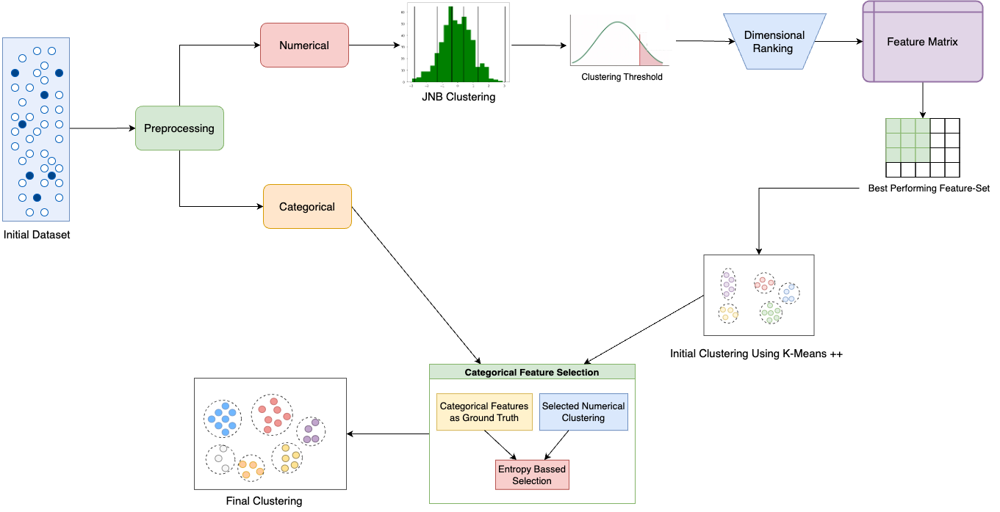
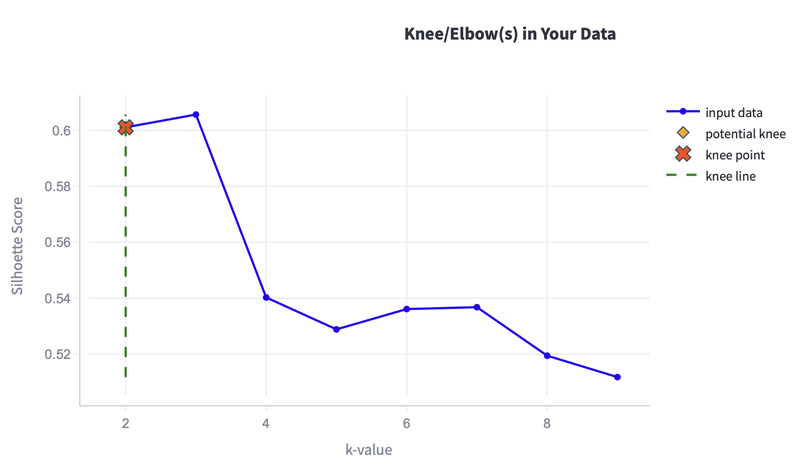
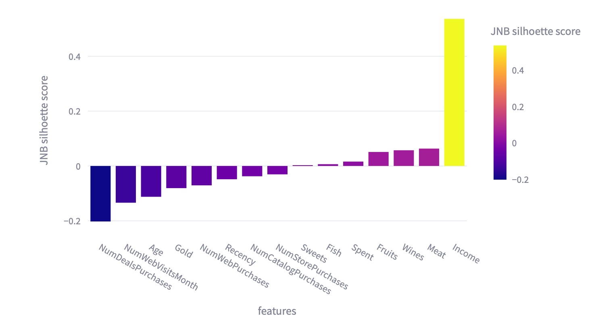
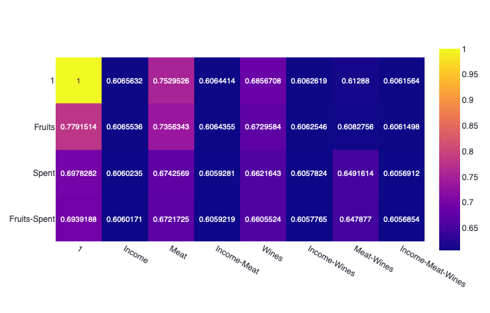
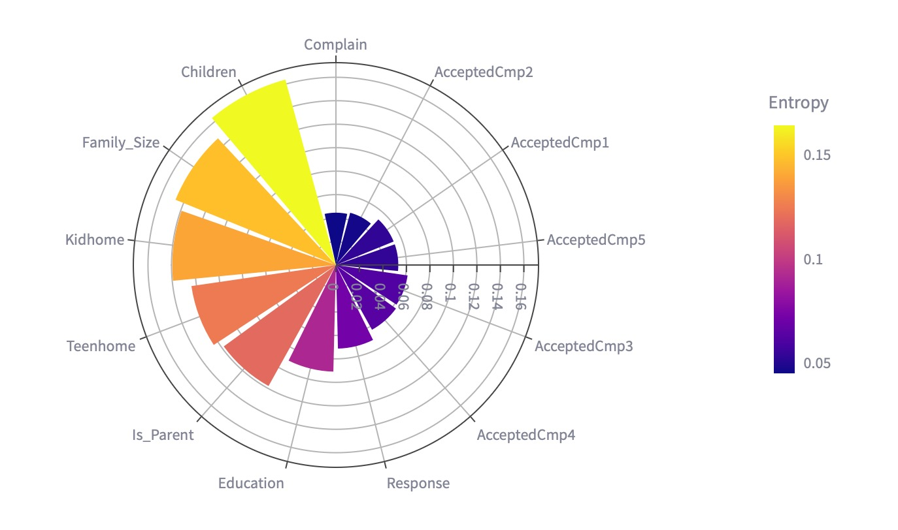
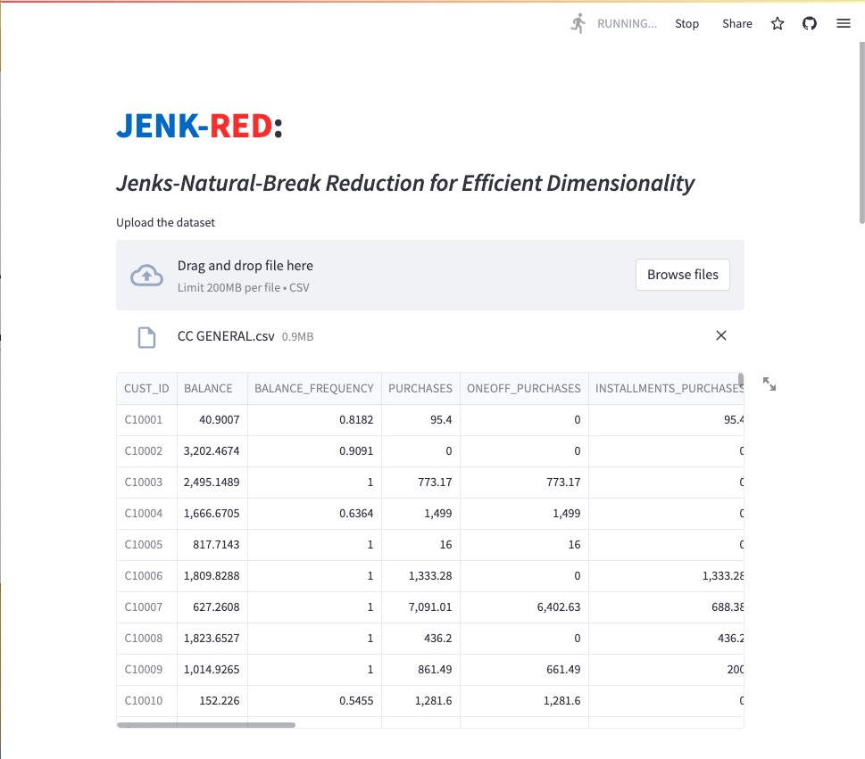

<h1> JENK-RED: Jenks-Natural-Break Reduction for Efficient Dimensionality </h1>

 [Madhushree Sannigrahi](https://scholar.google.com/citations?user=Mtnm7igAAAAJ&hl=en), [Abhimanyu Bhowmik](https://scholar.google.com/citations?user=r3bzJ7oAAAAJ&hl=en), [Runa Ganguli](https://scholar.google.com/citations?user=8IwbcvIAAAAJ&hl=en&oi=ao), [Soumya Sen](https://scholar.google.com/citations?hl=en&user=QNqOy8wAAAAJ&view_op=list_works&sortby=pubdate)

 

 A novel clusterinng and Dimensionality-reducing methodology using JNB and K-means++ to identify hidden connections between attributes.

 > **Abstract:** *Feature ranking and feature subset selection are important aspects of machine learning. Identifying the most significant feature or subset of features of any high-dimensional dataset that plays a major role in clustering enables faster computation. This article proposes a method to rank features or dimensions and recognize a feature subset that primarily contributes to clustering data points. We have used Jenks Natural Breaks algorithm to cluster categorical features and the K-Means++ algorithm to cluster all possible combinations of selected categorical features from the feature matrix. Silhouette score is used to determine the performance of clustering results. Clusters of data points belonging to categorical features are compared with that of numerical based on entropy to determine the finally selected important feature subset.*

 

<h2>Proposed Methods</h2>

<!--
  ======================Global Architecture===========================
                          -->

<h3>1. Globar Architecture</h3>

  

Overall view of the proposed model: JENK-RED 

 

<!--
  =========================Data Preprocessing========================= 
                          -->
<h3>2. Data Preprocessing </h3>

This stage involves processing the raw dataset to make it match the model. Firstly, all NaN values and irrelevant features are eliminated. The dataset is then normalised using LogTransformation to minimize its skewness. The data is then divided into numerical and category components. To do this, only characteristics with more than N number of distinct values were designated numerical features, while all other features were regarded as categorical. The string data is further Label Encoded to convert into integer format. The resulting dataset is much more suited for further processing by the machine learning model.

<h3>3. Feature Selection </h3>

Based on entropy we have selected features that will most likely match our numerical features. As entropy is a measurement of disorders, we can use it to represent similarity by checking entropy between two clusters. If the clusters are similar they will generate less entropy compared to dissimilar clusters. Firstly, we consider individual categorical features as ground truth values and compare them against our numerically selected features. All the categorical features are considered individually and using the entropy distribution as in the equation below, their cluster entropy is calculated. Here, p = selected numerical cluster and q = categorical ground truth values. These entropy values are then ranked and the one with the topmost value is considered for the final clustering.

Overall architecture of Categorical Feature Selection

 

<!--
  ====================================RESULTS===============================
                          -->

<h2>Results for Case Study 1: </h2>
<h3>1. K-means Clustering Report</h3>

The k-values silhouette score graph, showcasing the elbow value

<h3>2. JNB Clustering Report</h3>

The Silhouette scores of JNB Clustering are based on the features 

  

<h3>3. Feature Matrix</h3>

Feature matrix for case study 1

  

<h3>4. Entropy Graph</h3>

The entropy of each categorical feature w.r.t. The selected numeric feature/s

  

<!--
  ====================================WEB APPLICATION===============================
                          -->

<h2>JENK-RED: Application UI </h2>

The aim of developing **JENK - RED** application is to make our framework accessible for normal users who don’t have any technical knowledge. An interactive web application is developed using StreamLit Framework to make it possible. The Application is deployed on StreamLit cloud.

UI of deployed application using Streamlit

<h3>Get Started with the JENK-RED Application?</h3>  

To explore JENK-RED, follow these simple steps:

* **Open the Application:** Click the link provided: [JENK_RED](https://madhushree2000-jenks-natural-break-clustering-appmain-kv2dfk.streamlit.app)

* **Upload Your Dataset:** Select your desired numeric dataset. For convenience, some test datasets are available in the `\Test dataset` folder of the application repository.

Remember, JENK-RED is designed for **numeric** datasets under 200 MB. Ensure your input data aligns with this requirement for optimal results.

* **Set Categorical Feature Threshold:** This threshold determines how attributes are classified as numerical or categorical. Features with fewer unique values than the chosen threshold are considered categorical. Choose a suitable value based on your dataset characteristics.

* **Set K-Value Threshold:** This step checks the most optimal k value for clustering. The k-value threshold is used for testing different number of clusters. By default, it is set to 5.

* **JNB Clustering:** Select the percentange of data to be taken into consideration on its JNB clustering based on Silhoette Score.

All potential combinations from the chosen attributes are calculated and placed into a feature matrix for easy comparison. 

* **Categorical Feature Ranking:** Select the attributes which are important for you. Based on entropy, the user can select features that will most likely match their numerical features.
 

<h2>Cite our work</h2>
     Sannigrahi M., Bhowmik A., Ganguli R., Sen S. (2023) JENK-RED: Jenks-Natural-Break Reduction for Efficient Dimensionality (Preprint).

<h2>Contact</h2>
For any queries, please contact: <a href="mailto:madhushree162000@gmail.com">madhushree162000@gmail.com</a>.
